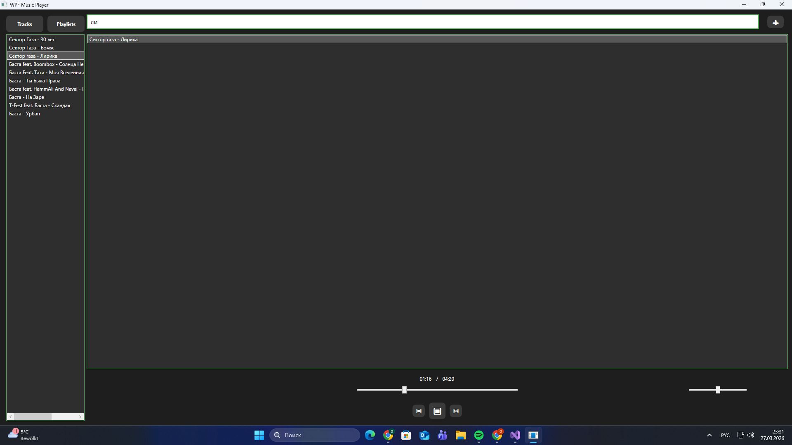
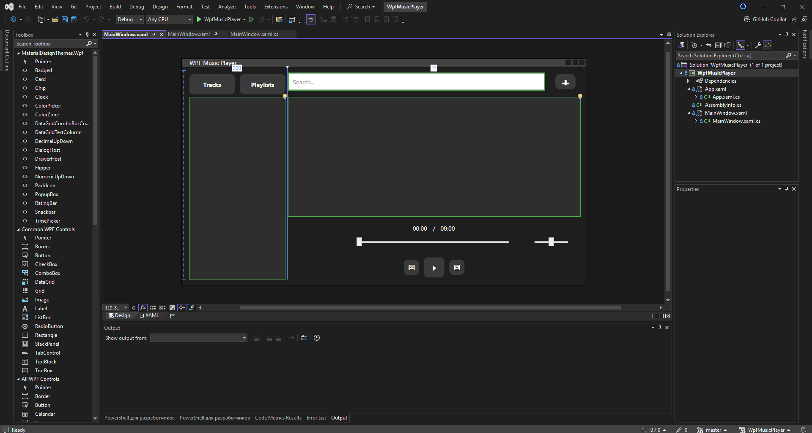

# WPF Music Player

**Technologies:** C#, WPF  
**Description:** Desktop music player with music adding via Explorer, play, stop, shuffle, repeat, volume control, and track position/seek control.

**Screenshot:**  

